<div align="center">

# Claude War Room

**Orchestrator of 5 specialized agents for 360° feature analysis with Claude Code.**

[](https://github.com/RandMelville/claude-war-room/actions)
[](LICENSE)
[](https://docs.anthropic.com/en/docs/claude-code)
[]()
[](CONTRIBUTING.md)
[]()

[🇧🇷 Português](README.md) | **🇺🇸 English**

**1 command. 5 perspectives. 1 executive report.**

</div>

---

> **War Room Mode** is an orchestration strategy that sequentially runs 5 specialized AI agents, each analyzing a different dimension of your code. The result is a complete executive report with detected failures, severity ratings, and an action plan.

<table>
<tr>
<td align="center"><b>Zero Dependencies</b><br/>Just Markdown files</td>
<td align="center"><b>30s Install</b><br/>One script, done</td>
<td align="center"><b>Customizable</b><br/>Adapt to any domain</td>
<td align="center"><b>Open Source</b><br/>MIT License</td>
</tr>
</table>

---

## Demo

<!-- TODO: Record a GIF of a real execution and replace this block -->
```
$ claude
> ativar modo war room: User Authentication System

[1/5] DOC-REVERSE — Mapping architecture and flows...
[2/5] ARQUITETO-INFRA — Identifying scalability bottlenecks...
[3/5] DEV-CONCURRENCY — Hunting race conditions...
[4/5] SRE-CHAOS — Simulating failure scenarios...
[5/5] LEAD-REPORT — Consolidating executive report...

Confidence Report: Index 🔴 Low
3 critical items identified | Action plan generated
```

---

## How It Works

```mermaid
graph LR
    CMD["ativar modo war room: [FEATURE]"] --> A1

    A1["1. DOC-REVERSE\nReverse Engineering"]
    A2["2. ARQUITETO-INFRA\nScalability"]
    A3["3. DEV-CONCURRENCY\nConcurrency"]
    A4["4. SRE-CHAOS\nChaos Engineering"]
    A5["5. LEAD-REPORT\nExecutive Report"]

    A1 -->|context + findings| A2
    A2 -->|context + findings| A3
    A3 -->|context + findings| A4
    A4 -->|context + findings| A5

    A5 -->|result| R["Confidence Report\nSeverity Table\nAction Plan"]

    style CMD fill:#1a1a2e,stroke:#e94560,color:#fff
    style A1 fill:#16213e,stroke:#0f3460,color:#fff
    style A2 fill:#16213e,stroke:#0f3460,color:#fff
    style A3 fill:#16213e,stroke:#0f3460,color:#fff
    style A4 fill:#16213e,stroke:#0f3460,color:#fff
    style A5 fill:#e94560,stroke:#0f3460,color:#fff
    style R fill:#0f3460,stroke:#e94560,color:#fff
```



Each agent **receives the context and findings from the previous ones**, building a progressively deeper analysis. The last agent consolidates everything into business language.

---

## The 5 Agents

| # | Alias | Agent | What it does | What it produces |
|---|-------|-------|-------------|-----------------|
| 1 | `DOC-REVERSE` | Reverse Engineering & Software Architect | Maps flows, business rules and architecture from code | Architecture Document with Mermaid diagrams |
| 2 | `ARQUITETO-INFRA` | Cloud Scalability Architect | Identifies infra bottlenecks, connection limits, missing cache | Bottleneck inventory + load simulation |
| 3 | `DEV-CONCURRENCY` | Concurrency & Distributed Systems Specialist | Hunts race conditions, deadlocks and data inconsistencies | Write-point map + locking recommendations |
| 4 | `SRE-CHAOS` | Chaos Engineer SRE | Simulates catastrophic failures and evaluates resilience | Disaster scenario catalog + resilience plan |
| 5 | `LEAD-REPORT` | Quality & Stability Lead | Consolidates everything into business language | Confidence Report with prioritized action plan |

---

## Prerequisites

- [Claude Code CLI](https://docs.anthropic.com/en/docs/claude-code) installed and configured
- **Claude Opus** model recommended (agents use `model: opus` by default)
- A code repository to analyze

---

## Installation

### Automatic (recommended)

```bash
git clone https://github.com/RandMelville/claude-war-room.git
cd claude-war-room
chmod +x install.sh
./install.sh
```

The script will:
1. Copy the 5 agents to `~/.claude/agents/`
2. Configure the orchestration trigger in the project memory

### Manual

1. **Copy the agents** to the Claude Code agents directory:

```bash
cp agents/*.md ~/.claude/agents/
```

2. **Configure the orchestration trigger.** Copy the memory file to your project's memory directory:

```bash
# Replace <PROJECT-PATH> with the absolute path of your project
# e.g.: -Users-john-Documents-my-project
PROJECT_DIR=~/.claude/projects/<PROJECT-PATH>/memory

mkdir -p "$PROJECT_DIR"
cp memory/feedback_war_room_mode.md "$PROJECT_DIR/"
```

3. **Update your project's MEMORY.md** (create if it doesn't exist):

```markdown
- [feedback_war_room_mode.md](./feedback_war_room_mode.md) - Command "ativar modo war room: [FEATURE]" orchestrates 5 sequential agents
```

---

## How to Use

1. Open Claude Code in the project directory you want to analyze
2. Type the command:

```
ativar modo war room: [FEATURE NAME]
```

> **Note:** The trigger command is in Portuguese. This is the default activation phrase. You can customize it — see [Customization](docs/CUSTOMIZATION.md).

**Examples:**

```
ativar modo war room: User Authentication System
ativar modo war room: CSV Import Pipeline
ativar modo war room: Payment Processing API
ativar modo war room: Real-time Notifications
```

3. Wait for the sequential execution of all 5 agents
4. The final report will be presented automatically by the last agent
5. **5 Markdown documents** are automatically generated in the `war-room/[feature]/` folder of your project

---

## What to Expect

### Output from each agent

1. **DOC-REVERSE** — Architecture document with stack, step-by-step flows, Mermaid diagrams, extracted business rules
2. **ARQUITETO-INFRA** — Bottleneck map with breaking points, load simulation with 1,000 concurrent accesses
3. **DEV-CONCURRENCY** — Race condition scenarios with temporal sequences (T1, T2), transaction and locking analysis
4. **SRE-CHAOS** — Disaster catalog with failure sequence (T+0, T+30s, T+5min), timeout and circuit breaker analysis
5. **LEAD-REPORT** — Consolidated Confidence Report

### Auto-generated documents

After execution, **5 Markdown files** are automatically created in the `war-room/[feature]/` folder of your project:

```
war-room/
└── authentication-system/
    ├── 01-doc-reverse-arquitetura.md
    ├── 02-arquiteto-infra-escalabilidade.md
    ├── 03-dev-concurrency-race-conditions.md
    ├── 04-sre-chaos-cenarios-desastre.md
    └── 05-lead-report-relatorio-executivo.md
```

Documents can be shared directly via GitHub, Confluence, Notion or any Markdown viewer — Mermaid diagrams render correctly.

### Final Report Format

The final report always includes this table:

| Component | Detected Failure | Severity (1-10) | Short-term Action |
|-----------|-----------------|------------------|-------------------|
| Grades Service | Race condition on UPDATE | 9 | Add optimistic locking |
| CSV Import | Memory overflow with files >5k lines | 8 | Implement streaming |
| API Gateway | No timeout for Auth service | 7 | Configure 3s timeout |

---

## Repository Structure

```
claude-war-room/
├── README.md                     # Portuguese guide
├── README.en.md                  # English guide (this file)
├── LICENSE                       # MIT
├── install.sh                    # Installation script
├── agents/
│   ├── 01-reverse-engineering-architect.md
│   ├── 02-scalability-architect.md
│   ├── 03-concurrency-specialist.md
│   ├── 04-chaos-engineer-sre.md
│   └── 05-quality-stability-lead.md
├── memory/
│   └── feedback_war_room_mode.md
└── docs/
    ├── ARCHITECTURE.md           # Deep dive into each agent
    ├── CUSTOMIZATION.md          # How to adapt to your domain
    └── EXAMPLES.md               # Example outputs
```

---

## Customization

The agents come configured for the **EdTech** domain (educational platforms), but can be adapted to any context. See the full guide at [docs/CUSTOMIZATION.md](docs/CUSTOMIZATION.md).

Quick overview:
- Replace domain terms (schools, teachers, grades) with your own context
- Adjust scale metrics (1,000 schools → your volume)
- Switch `model: opus` to `model: sonnet` to reduce cost (less depth)
- Add or remove agents from the pipeline by editing `feedback_war_room_mode.md`

---

## Why 5 agents? Why sequential?

**Why 5 different perspectives:**
Each agent has a purposeful "bias" — the architect thinks about flows, the SRE thinks about failures, the concurrency specialist thinks about race conditions. Together, they cover blind spots that a single prompt could never catch.

**Why sequential and not parallel:**
Each agent builds upon the findings of the previous one. The Chaos SRE, for example, uses the Scalability Architect's infrastructure map to know which failure points to test. The Quality Lead uses ALL previous findings to prioritize.

---

## Contributing

Contributions are welcome! Read the [Contributing Guide](CONTRIBUTING.md) to get started.

Some ideas:

- Translate agents to English
- Create additional agents (e.g.: Security Auditor, Performance Profiler)
- Improve output templates
- Add real-world examples (anonymized)
- Adapt for new domains (FinTech, HealthTech, SaaS)

---

## Star History

[](https://star-history.com/#RandMelville/claude-war-room&Date)

---

<div align="center">

## Built with

[](https://docs.anthropic.com/en/docs/claude-code)
[](https://anthropic.com)

**Built by [@RandMelville](https://github.com/RandMelville)**

</div>

---

## License

[MIT](LICENSE)
