<div align="center">

# Claude War Room

**Orquestrador de 5 agentes especializados para análise 360° de features com Claude Code.**

[](https://github.com/RandMelville/claude-war-room/actions)
[](LICENSE)
[](https://docs.anthropic.com/en/docs/claude-code)
[]()
[](CONTRIBUTING.md)
[]()

**🇧🇷 Português** | [🇺🇸 English](README.en.md)

**1 comando. 5 perspectivas. 1 relatório executivo.**

</div>

---

> O **Modo War Room** é uma estratégia de orquestração que executa sequencialmente 5 agentes de IA especializados, cada um analisando uma dimensão diferente do seu código. O resultado é um relatório executivo completo com falhas detectadas, severidades e plano de ação.

<table>
<tr>
<td align="center"><b>Zero Dependências</b><br/>Apenas arquivos Markdown</td>
<td align="center"><b>Instalação em 30s</b><br/>Um script, pronto</td>
<td align="center"><b>Personalizável</b><br/>Adapte para qualquer domínio</td>
<td align="center"><b>Open Source</b><br/>MIT License</td>
</tr>
</table>

---

## Demo

<!-- TODO: Gravar GIF de uma execução real e substituir este bloco -->
```
$ claude
> ativar modo war room: Sistema de Lançamento de Notas

[1/5] DOC-REVERSE — Mapeando arquitetura e fluxos...
[2/5] ARQUITETO-INFRA — Identificando gargalos de escala...
[3/5] DEV-CONCURRENCY — Caçando race conditions...
[4/5] SRE-CHAOS — Simulando cenários de falha...
[5/5] LEAD-REPORT — Consolidando relatório executivo...

Report de Confiança: Índice 🔴 Baixo
3 itens críticos identificados | Plano de ação gerado
```

---

## Como Funciona

```mermaid
graph LR
    CMD["ativar modo war room: [FEATURE]"] --> A1

    A1["1. DOC-REVERSE\nEngenharia Reversa"]
    A2["2. ARQUITETO-INFRA\nEscalabilidade"]
    A3["3. DEV-CONCURRENCY\nConcorrência"]
    A4["4. SRE-CHAOS\nChaos Engineering"]
    A5["5. LEAD-REPORT\nRelatório Executivo"]

    A1 -->|contexto + descobertas| A2
    A2 -->|contexto + descobertas| A3
    A3 -->|contexto + descobertas| A4
    A4 -->|contexto + descobertas| A5

    A5 -->|resultado| R["Report de Confiança\nTabela de Severidade\nPlano de Ação"]

    style CMD fill:#1a1a2e,stroke:#e94560,color:#fff
    style A1 fill:#16213e,stroke:#0f3460,color:#fff
    style A2 fill:#16213e,stroke:#0f3460,color:#fff
    style A3 fill:#16213e,stroke:#0f3460,color:#fff
    style A4 fill:#16213e,stroke:#0f3460,color:#fff
    style A5 fill:#e94560,stroke:#0f3460,color:#fff
    style R fill:#0f3460,stroke:#e94560,color:#fff
```



Cada agente **recebe o contexto e as descobertas dos anteriores**, construindo uma análise progressivamente mais profunda. O último agente consolida tudo em linguagem de negócio.

---

## Os 5 Agentes

| # | Alias | Agente | O que faz | O que produz |
|---|-------|--------|-----------|--------------|
| 1 | `DOC-REVERSE` | Reverse Engineering & Software Architect | Mapeia fluxos, regras de negócio e arquitetura a partir do código | Documento de Arquitetura com diagramas Mermaid |
| 2 | `ARQUITETO-INFRA` | Cloud Scalability Architect | Identifica gargalos de infra, limites de conexão, falta de cache | Inventário de gargalos + simulação de carga |
| 3 | `DEV-CONCURRENCY` | Concurrency & Distributed Systems Specialist | Caça race conditions, deadlocks e inconsistências de dados | Mapa de pontos de escrita + recomendações de locking |
| 4 | `SRE-CHAOS` | Chaos Engineer SRE | Simula falhas catastróficas e avalia resiliência | Catálogo de cenários de desastre + plano de resiliência |
| 5 | `LEAD-REPORT` | Quality & Stability Lead | Consolida tudo em linguagem de negócio | Report de Confiança com plano de ação priorizado |

---

## Pré-requisitos

- [Claude Code CLI](https://docs.anthropic.com/en/docs/claude-code) instalado e configurado
- Modelo **Claude Opus** recomendado (os agentes usam `model: opus` por padrão)
- Um repositório de código para analisar

---

## Instalação

### Automática (recomendada)

```bash
git clone https://github.com/RandMelville/claude-war-room.git
cd claude-war-room
chmod +x install.sh
./install.sh
```

O script vai:
1. Copiar os 5 agentes para `~/.claude/agents/`
2. Configurar o trigger de orquestração na memória do projeto

### Manual

1. **Copie os agentes** para o diretório de agentes do Claude Code:

```bash
cp agents/*.md ~/.claude/agents/
```

2. **Configure o trigger de orquestração.** Copie o arquivo de memória para o diretório de memória do seu projeto:

```bash
# Substitua <CAMINHO-DO-PROJETO> pelo caminho absoluto do seu projeto
# Ex: -Users-fulano-Documents-meu-projeto
PROJECT_DIR=~/.claude/projects/<CAMINHO-DO-PROJETO>/memory

mkdir -p "$PROJECT_DIR"
cp memory/feedback_war_room_mode.md "$PROJECT_DIR/"
```

3. **Atualize o MEMORY.md** do seu projeto (crie se não existir):

```markdown
- [feedback_war_room_mode.md](./feedback_war_room_mode.md) - Comando "ativar modo war room: [FEATURE]" orquestra 5 agentes sequenciais
```

---

## Como Usar

1. Abra o Claude Code no diretório do projeto que deseja analisar
2. Digite o comando:

```
ativar modo war room: [NOME DA FEATURE]
```

**Exemplos:**

```
ativar modo war room: Sistema de Lançamento de Notas
ativar modo war room: Importação de CSV de Alunos
ativar modo war room: Autenticação e Autorização
ativar modo war room: API de Relatórios
```

3. Aguarde a execução sequencial dos 5 agentes
4. O relatório final será apresentado automaticamente pelo último agente
5. Os **5 documentos Markdown** serão gerados automaticamente na pasta `war-room/[feature]/` do seu projeto

---

## O que Esperar

### Saída de cada agente

1. **DOC-REVERSE** — Documento de arquitetura com stack, fluxos step-by-step, diagramas Mermaid, regras de negócio extraídas
2. **ARQUITETO-INFRA** — Mapa de gargalos com pontos de ruptura, simulação de carga com 1.000 acessos simultâneos
3. **DEV-CONCURRENCY** — Cenários de race condition com sequências temporais (T1, T2), análise de transações e locking
4. **SRE-CHAOS** — Catálogo de desastres com sequência de falha (T+0, T+30s, T+5min), análise de timeouts e circuit breakers
5. **LEAD-REPORT** — Report de Confiança consolidado

### Documentos gerados automaticamente

Ao final da execução, **5 arquivos Markdown** são criados automaticamente na pasta `war-room/[feature]/` do seu projeto:

```
war-room/
└── sistema-de-notas/
    ├── 01-doc-reverse-arquitetura.md
    ├── 02-arquiteto-infra-escalabilidade.md
    ├── 03-dev-concurrency-race-conditions.md
    ├── 04-sre-chaos-cenarios-desastre.md
    └── 05-lead-report-relatorio-executivo.md
```

Os documentos podem ser compartilhados diretamente via GitHub, Confluence, Notion ou qualquer viewer Markdown — os diagramas Mermaid renderizam corretamente.

### Formato do Report Final

O relatório final sempre inclui esta tabela:

| Componente | Falha Detectada | Severidade (1-10) | Ação de Curto Prazo |
|------------|-----------------|---------------------|---------------------|
| Serviço de Notas | Race condition em UPDATE | 9 | Adicionar optimistic locking |
| Import CSV | Estouro de memória com arquivos >5k linhas | 8 | Implementar streaming |
| API Gateway | Sem timeout para serviço de Auth | 7 | Configurar timeout de 3s |

---

## Estrutura do Repositório

```
claude-war-room/
├── README.md                     # Este arquivo
├── LICENSE                       # MIT
├── install.sh                    # Script de instalação
├── agents/
│   ├── 01-reverse-engineering-architect.md
│   ├── 02-scalability-architect.md
│   ├── 03-concurrency-specialist.md
│   ├── 04-chaos-engineer-sre.md
│   └── 05-quality-stability-lead.md
├── memory/
│   └── feedback_war_room_mode.md
└── docs/
    ├── ARCHITECTURE.md           # Deep dive de cada agente
    ├── CUSTOMIZATION.md          # Como adaptar para seu domínio
    └── EXAMPLES.md               # Exemplos de saída
```

---

## Personalização

Os agentes vêm configurados para o domínio **EdTech** (sistemas educacionais), mas podem ser adaptados para qualquer contexto. Veja o guia completo em [docs/CUSTOMIZATION.md](docs/CUSTOMIZATION.md).

Resumo rápido:
- Substitua termos de domínio (escolas, professores, notas) pelos do seu contexto
- Ajuste métricas de escala (1.000 escolas → seu volume)
- Troque `model: opus` por `model: sonnet` para reduzir custo (menor profundidade)
- Adicione ou remova agentes do pipeline editando `feedback_war_room_mode.md`

---

## Por que 5 agentes? Por que sequencial?

**Por que 5 perspectivas diferentes:**
Cada agente tem um "viés" proposital — o arquiteto pensa em fluxos, o SRE pensa em falhas, o especialista em concorrência pensa em race conditions. Juntos, cobrem pontos cegos que um único prompt não conseguiria.

**Por que sequencial e não paralelo:**
Cada agente constrói sobre as descobertas do anterior. O SRE de Chaos, por exemplo, usa o mapa de infraestrutura do Arquiteto de Escalabilidade para saber quais pontos de falha testar. O Lead de Qualidade usa TODAS as descobertas anteriores para priorizar.

---

## Contribuição

Contribuições são bem-vindas! Leia o [Guia de Contribuição](CONTRIBUTING.md) para começar.

Algumas ideias:

- Traduzir agentes para inglês
- Criar agentes adicionais (ex: Security Auditor, Performance Profiler)
- Melhorar os templates de saída
- Adicionar exemplos reais (anonimizados)
- Adaptar para novos domínios (FinTech, HealthTech, SaaS)

---

## Star History

[](https://star-history.com/#RandMelville/claude-war-room&Date)

---

<div align="center">

## Feito com

[](https://docs.anthropic.com/en/docs/claude-code)
[](https://anthropic.com)

**Construído por [@RandMelville](https://github.com/RandMelville)**

</div>

---

## Licença

[MIT](LICENSE)
